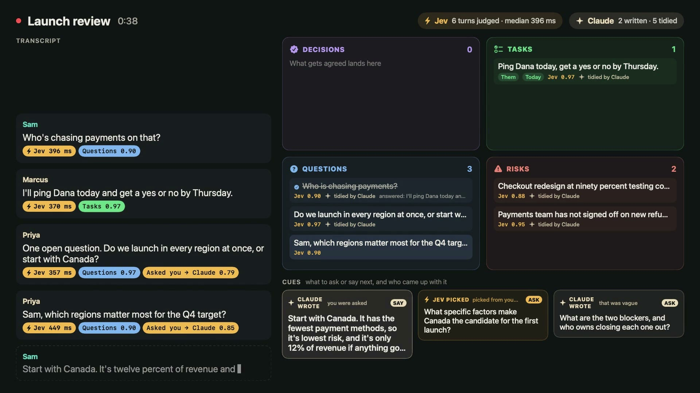

# Cuecard

A menu-bar meeting copilot for macOS 26. It listens with you and, while the meeting is happening, shows what to say, what to ask and what to write down.

**[▶ Watch the 60-second demo](docs/cuecard-demo.mp4)**: a fictional meeting run live through the real app.

- **Jev** judges every turn of the conversation in about 0.4 s: is this a commitment, a decision, an open question, a risk, something asked of you? Plain code files what scores 0.7 or more into Decisions, Tasks, Questions or Risks, and ticks a question off when a later turn answers it.
- **Claude** writes only when words are needed: what to say when you're asked, a follow-up when an answer is vague, clean wording for what was captured, and the recap afterwards.
- Everything on screen in the demo came from that run: each verdict's score and latency, and every card Claude wrote. The meeting is scripted (clean text, no speech recognition) and plays at 1.5× speed.

## How it works

| Layer | What does it | Speed |
|---|---|---|
| Hearing | Mic (AVAudioEngine) and the Mac's audio (Core Audio process tap), each transcribed on-device by its own SpeechAnalyzer, so every sentence knows whether You or Them said it | final sentence ~0.3 s after it's spoken |
| Sorting | Jev (TypeSafe) judges each finished turn: the 7 core categories, the mode's signals, which open question it answers, who owns an action, which prepared question fits next | ~0.4 s |
| Writing | Claude through `claude -p` (your Claude Code login, one warm process per prompt): answers when you're asked, new questions when nothing prepared fits, tidy wording for captures, running memory, recap | first words ~0.8 s |

Code, not a model, decides what reaches the screen (thresholds, at most two captures per turn, one signal card per turn, no repeat within 4 min).

## The categorisation framework

Core categories, every meeting: **Asked you** (→ SAY card), **Action item** (owner, due), **Decision**, **Open question** (auto-marked answered), **Next step**, **Risk / blocker**, **Key fact**. Gates: **Vague** (→ a clarifying ASK) and **Filler** (ignored).

Signals by mode:

| Mode | Signals | Question bank |
|---|---|---|
| Meeting | Disagreement | scope, owners, dates, risks |
| Interviewing | Strong evidence, No numbers, "We" not "I", Surface answer, Red flag | competencies × opener + probes, tied to the resume |
| Being interviewed | They're probing, What they value, Possible concern | questions to ask them, likely questions to prepare |
| 1:1 | Hesitation, Frustration, Overload, Unspoken ask, Growth, Low energy | wellbeing, workload, blockers, growth, follow-ups |
| Review / decision | Disagreement, No owner, Scope creep, Dependency | what's decided, options, owners, what changes our mind |
| Customer call | Pain, Workaround, Objection, Buying signal, Quote | discovery |
| Watching a recording | Unclear, Claim to check, Ask the presenter, Relevant to you | questions to take away; no SAY cards, since nobody can ask you anything |

Follow-up questions come from two places: the **question bank** Claude writes from your prep (Jev picks the one that fits the moment and ticks it off when you ask it), and **live questions** Claude writes when a signal or a vague answer needs a new one.

## Use

- ⌃⌥A start / stop · ⌃⌥S show / hide the panel · ⌃⌥N help me now
- Before a meeting: pick the mode, add a goal and context (paste or attach a JD, resume, last 1:1 notes), optionally Prepare questions.
- When Teams, Zoom or Chrome takes the mic, the panel offers to listen. When the call lets go of the mic for a minute and nobody is talking, Cuecard wraps up.
- The panel is hidden from screen sharing by default.
- Notes save to `~/Documents/Cuecard/` as Markdown: recap, captures, question coverage, transcript.

Permissions: Microphone and System Audio Recording (for the other side). Cuecard never reads your calendar: titles and Notion lookups come from what is said.

## Meeting pages

Every meeting gets a page at `~/Documents/Cuecard/pages/<note>.html`, built from its Markdown note: the recap, what was captured live, and the transcript with a You/Them filter and search. `~/Documents/Cuecard/index.html` lists them by day with a mode filter and search. Open it from the menu (Open meetings library, ⌘L), or Page on the panel once a recap is done. Pages for older notes are written on launch.

## Bring your own context

Cuecard's cues are only as good as what it knows about your work. There are four ways to give it that:

| When | How | What happens |
|---|---|---|
| Before the meeting | Type or paste into the context box on the prep screen, or **Add a file** (PDF, Word, text, Markdown) | Prepare writes a question bank from it; every suggestion reads it |
| Before the meeting | **From my sources** on the prep screen, using the title, goal or notes you typed | Pulls open items, last decisions and background into the context box |
| During the meeting | The **+** beside the ask bar: paste a note or attach a file | Joins the meeting's context straight away, and up to three questions are written from it |
| During the meeting | Automatic, about 2½ minutes in and again around 12 minutes | Works out the topic from what is being said, names the meeting, and searches your sources |

**Your sources** are set in Settings → Context sources:

- **Find my sources** lists every MCP server in your Claude Code setup (`claude mcp list`): Notion, Google Drive, Confluence, Linear, GitHub, anything you have connected. Tick the ones Cuecard may search.
- **Notes folder**: point it at a folder of Markdown or text notes (an Obsidian vault, a meeting-notes folder).
- Lookups run through `claude -p` on your own Claude Code login. Cuecard lists each server's tools once and allows only the ones that read: any tool whose name says it creates, updates, sends, deletes, moves, uploads or changes anything is left out, as are shell and file-writing tools. `Cuecard --sources` prints the servers and exactly which tools are allowed.
- Cuecard never uses your calendar. Calendar titles are often wrong ("Gym" for a vendor session), so the topic comes from what is said.

## After the write-up

`defaults write com.vaibhav.cuecard afterWriteUp "/path/to/script"` runs that command with the saved note's path once each recap is written (for example, to file it into a notes app).

## Meeting board

Menu → Open meeting board (⌘B) opens a wide window beside the panel: the transcript with Jev's verdict under each turn (how long it took, which box it filed to), a 2×2 of Decisions, Tasks, Questions and Risks that fills as people talk (the words swirl from the sentence into their box; open questions tick themselves off when a later turn answers them), and Cues: what to ask or say next, marked "Jev picked" (from your prepared questions, with Jev's score) or "Claude wrote".

## Demo video

`demo/launch-review.txt` is a fictional meeting. `Cuecard --demo-render demo/launch-review.txt demo/out 10 -name Sam -about "…"` plays it through the real pipeline (Jev judges each turn, Claude writes the suggestions) and saves the live panel as frames plus `events.json` with every verdict and its latency; the `-name`/`-about` launch arguments override your settings for that run only. With `DEMO_VIEW=board` it records the meeting board instead (snapshots at 30 fps, drawn after the run). `demo/video/build_board.py` (board) and `demo/video/build.py` (panel) turn a run into a HyperFrames composition (`npx hyperframes render` in `demo/video`). Every label and millisecond in the video comes from the run.

## Build

`./build.sh` (installs to `~/Applications/Cuecard.app`). Checks without the UI:

- `Cuecard --simulate script.txt oneOnOne [--recap]` runs a scripted meeting through Jev and Claude
- `Cuecard --transcribe me.wav them.wav` runs audio files through the transcribers
- `Cuecard --render out.png live|prep|notes|questions|recap|mini` draws the panel with sample data
- Log: `~/Library/Logs/Cuecard.log`
